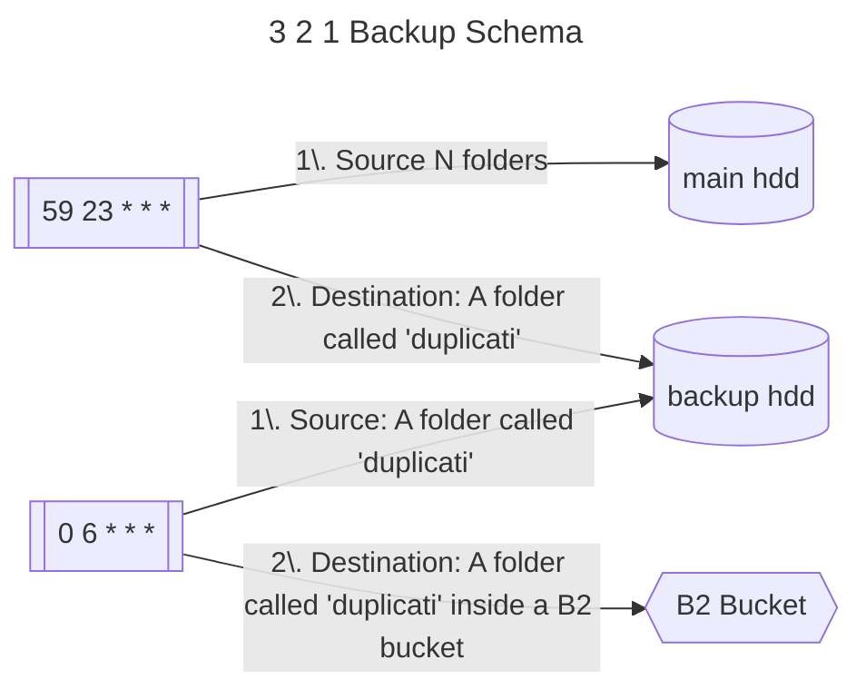

Atualmente, possuo dois servidores:

## `proxmox`

O objetivo do servidor com proxmox é basicamente rodar um media server (com [ownyourownapps/arrstack](https://github.com/ownyourownapps/arrstack)) + uma outra VM genérica com alguns serviços presentes em [homelab](https://github.com/sergiohpreis/homelab) (como immich, homebox e etc), uma instância de [sergiohpreis/nextcloud](https://github.com/sergiohpreis/nextcloud).

## `beelink`

Basicamente, por hora, esse servidor hospeda a aplicação [[Sobre as motivações que me levaram a criar um agregador de coleções|collector]] que estava no EC2.

## Esquema de Backup

## Problemas conhecidos

- [ ] Não estou conseguindo acessar a interface web do `proxmox`. Preciso investigar o que esta acontecendo

---