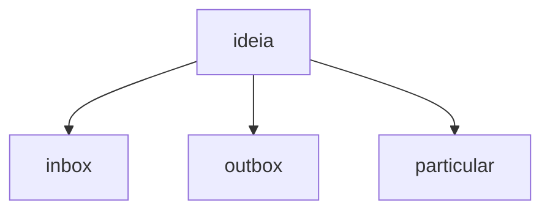
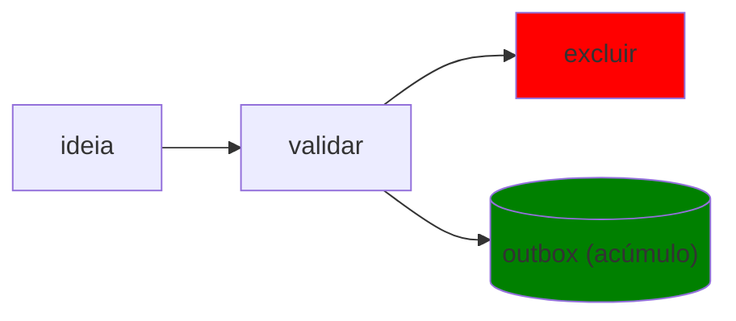

A primeira coisa que eu faço quando eu penso em algo que eu quero escrever (que podemos chamar de idéia), é:

1. abrir o Obsidian
2. apertar Ctrl + N
3. Pensar no título que melhor descreve a idéia que eu quero transmitir

Em seguida, eu escolho o seu destino dessa idéia 

A partir de então, eu escrevo.

- se é uma idéia que vai ficar no `inbox` eu simplesmente penso em algumas tags e pronto
- se é uma idéia para o `outbox` (e portanto para o jardim digital), copio os atributos básicos (título, draft, date e etc) e preencho

De tempos em tempos eu reviso tudo que está em `draft`.

E ai através de `rm -rf content/* && cp -R ../brain/outbox/* content && npx quartz build --serve` eu consigo ter uma prévia

Através de  `rm -rf content/* && cp -R ../brain/outbox/* content && npx quartz sync` eu faço a publicação

## A outra parte do processo

Esse fluxo permite que ao rever uma idéia que se encontra no `inbox` (ou até mesmo em `particular`).

Ou seja, algo que era uma idéia é validado e tem dois destinos: a exclusão ou a sua publicação (enquanto um [acúmulo](/))

## Refs

- Ver mais sobre jardim digital em
	- [[Reflexões sobre o ato de escrever, de ler e sobre manter um Jardim Digital]]
	- [[Porque eu decidi criar um Digital Garden]]