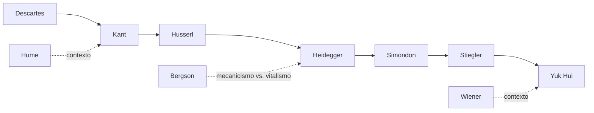

# Plano de Estudos em Filosofia

## 

_Fevereiro 2026 — Atualizado em 11/02/2026_

---

## Contexto e Objetivo

Este plano estrutura um percurso autodidata em filosofia partindo da formação moderna (Descartes, Kant) em direção à filosofia da técnica contemporânea (Heidegger, Simondon, Stiegler, Yuk Hui). A motivação original foi a leitura de _Tecnodiversidades_ de Yuk Hui, que faz referências constantes a Heidegger e pressupõe bases filosóficas específicas.

O percurso segue a lógica de que autores contemporâneos constroem sobre e criticam tradições anteriores — ler as críticas sem conhecer os alvos empobrece a compreensão. Porém, diferente de um bacharelado completo, este plano traça o **caminho mínimo necessário** para o destino específico: filosofia da técnica.

**Ritmo:** ~1 hora por dia, método global-analítico-sintético (Délcio Salomon).

---

## Princípios Orientadores

- **Base antes da crítica:** autores contemporâneos como Foucault, Heidegger e Yuk Hui criticam e reconstroem tradições. Sem conhecer os alvos, a leitura fica superficial.
- **Caminho mínimo dirigido:** não é necessário um bacharelado completo. O próprio Yuk Hui veio da engenharia da computação e fez doutorado dirigido com Stiegler. O que importa é profundidade no eixo relevante.
- **Comentários são essenciais:** para autodidata, bons comentadores compensam a ausência de orientação presencial.
- **Flexibilidade no cronograma:** as semanas são estimativas. Kant e Heidegger provavelmente exigirão mais tempo. Não apressar para cumprir prazo.

---

## Cadeia de Influências

---

## Fase 0 — Descartes ✅ CONCLUÍDA

**Semanas 1–8**

- **Textos:** _Discurso do Método_ (trad. Maria Ermantina Galvão, Martins Fontes); _Meditações sobre Filosofia Primeira_
- **Status:** Concluído. Sínteses produzidas de todas as partes.

---

## Fase 1 — Consolidação Descartes

**Semanas 9–12**

- **Texto:** Franklin Leopoldo e Silva — _A Metafísica da Modernidade_ (Editora Moderna, 1993)
- **Objetivo:** Consolidar a compreensão de Descartes através do comentador oficial da disciplina FLF0113 (USP). Cruzar com as sínteses já produzidas do _Discurso_ e das _Meditações_.
- **Método:** Leitura atenta, confrontando cada capítulo com as próprias sínteses. Anotar onde o Franklin revela camadas que passaram despercebidas.

---

## Fase 2 — Hume (Contextual)

**Semanas 13–14**

- **Texto:** _Investigações acerca do Entendimento Humano_ — apenas seções IV–VII
- **Objetivo:** Compreender o problema da causalidade e da indução que "despertou Kant do sono dogmático". Não é uma etapa de aprofundamento no empirismo, mas de contextualização para Kant.
- **Foco:** Crítica à causalidade, limites do conhecimento empírico, ceticismo sobre a metafísica.

> **Nota:** Hume não é central para o destino (Heidegger/Yuk Hui), mas é indispensável para entender _por que_ Kant faz o que faz. Leitura breve e focada. Se no futuro surgir necessidade de aprofundamento no empirismo, voltar ao texto completo com mais maturidade.

---

## Fase 3 — Kant

**Semanas 15–24**

### 3a: Prolegômenos (sem. 15–19)

- **Texto:** _Prolegômenos a Toda Metafísica Futura_ (Edições 70)
- **Objetivo:** Entrada acessível na filosofia crítica. Os _Prolegômenos_ seguem caminho "analítico" (dos resultados às condições), facilitando a compreensão antes da _Crítica_.
- **Temas-chave** (alinhados à ementa FLF0113): Juízos sintéticos a priori; Fenômeno e coisa em si; Ideias da razão; Limites da metafísica.

### 3b: Sobre Kant — Lebrun (sem. 20–22)

- **Texto:** Gérard Lebrun — _Sobre Kant_ (Iluminuras, 1993) `ebook Kindle`
- **Objetivo:** Comentário de referência da bibliografia USP. Ensaios que cobrem a relação Hume-Kant, o "despertar do sono dogmático", a distinção sensível-inteligível e a filosofia crítica.

### 3c: Crítica da Razão Pura — partes selecionadas (sem. 23–24+)

- **Texto:** _Crítica da Razão Pura_ (Coleção Os Pensadores)
- **Foco:** Estética Transcendental + Analítica dos Conceitos. Partes essenciais para o percurso rumo a Heidegger.

> **Nota:** Esta etapa pode se estender além das semanas estimadas. A _Crítica_ é densa e não deve ser apressada.

---

## Fase 4 — Husserl

**Semanas 25–30**

- **Texto provável:** _A Ideia da Fenomenologia_ ou _Meditações Cartesianas_ (a definir quando chegar nesta etapa)
- **Objetivo:** Husserl é a base direta de Heidegger. Sem fenomenologia, _Ser e Tempo_ fica opaco. Conceitos essenciais: intencionalidade, redução fenomenológica, crítica ao naturalismo.

> **Nota:** O texto e comentário serão definidos mais perto da data, com base no progresso e nas necessidades que surgirem.

---

## Fase 5 — Heidegger

**Semanas 31–40**

### 5a: A Questão da Técnica

- **Texto:** _A Questão da Técnica_ (ensaio)
- **Objetivo:** Texto curto e diretamente ligado ao destino final. Conceitos de _Gestell_ (enquadramento), desvelamento, e a essência da técnica moderna.

### 5b: Bergson — leitura pontual

- **Texto:** _A Evolução Criadora_ — capítulos selecionados (caps. 1–2)
- **Objetivo:** Yuk Hui mobiliza Bergson extensamente nos caps. 4 e 6 de _Tecnodiversidades_: a oposição mecanicismo/vitalismo, o conceito de _élan vital_, a definição de inteligência como fabricação de ferramentas (Homo faber), e a frase-chave "a mecânica exigiria uma mística". Bergson é o interlocutor que Wiener pretende superar com a cibernética — sem conhecê-lo, a crítica de Yuk Hui à cibernética perde uma camada importante.
- **Foco:** Duração vs. espaço, élan vital, inteligência como geometrização da matéria, relação orgânico/mecânico.

> **Nota:** Não é uma fase autônoma. Bergson entra aqui porque a leitura de Heidegger (_A Questão da Técnica_) e a transição para Simondon/Wiener exigem compreender o que a cibernética pretendeu superar. Leitura breve e dirigida — 2 semanas no máximo.

### 5c: Ser e Tempo — partes selecionadas

- **Texto:** _Ser e Tempo_
- **Foco:** Dasein, ser-no-mundo, temporalidade. Partes selecionadas conforme necessário para o percurso. Yuk Hui dialoga especificamente com os §§17–18 (referência e sinal, conjuntura e significância) no cap. 6 de _Tecnodiversidades_.

---

## Fase 6 — Simondon

**Semanas 41–44**

- **Texto:** _Do Modo de Existência dos Objetos Técnicos_ `já adquirido`
- **Objetivo:** Simondon pensa a relação humano-técnica fora da oposição tecnofobia/tecnofilia. Conceitos de individuação, meio associado e cultura técnica. Stiegler dialoga diretamente com Simondon.

---

## Fase 7 — Stiegler

**Semanas 45–50**

- **Texto principal:** _La Technique et le Temps_ (A Técnica e o Tempo)
- **Texto de apoio:** Anne Alombert — _Penser avec Bernard Stiegler_ (PUF, 2025) como introdução sistemática
- **Objetivo:** Stiegler é o elo direto entre Heidegger/Simondon e Yuk Hui (que fez doutorado sob sua orientação). Conceitos-chave: exteriorização, _pharmakon_, proletarização dos saberes, gramatização, negentropia.
- **Contexto:** Stiegler parte de Heidegger (questão da técnica), Simondon (objetos técnicos), Derrida (_pharmakon_), e Marx (economia política) para pensar a técnica como constitutiva da memória e da formação humana.

---

## Fase 8 — Wiener + Yuk Hui

**Semanas 51+**

### 8a: Wiener

- **Texto:** _Cibernética_ `já adquirido`
- **Objetivo:** Yuk Hui dialoga criticamente com a cibernética — a ideia de "tecnodiversidade" se opõe à universalização cibernética. Ler Wiener permite entender o alvo da crítica.

### 8b: Yuk Hui

- **Texto:** _Tecnodiversidades_
- **Objetivo:** Retorno ao livro que motivou todo o percurso, agora com a base construída: metafísica moderna (Descartes/Kant), fenomenologia (Husserl), mecanicismo vs. vitalismo (Bergson), questão da técnica (Heidegger), objetos técnicos (Simondon), técnica e tempo (Stiegler), cibernética (Wiener).

---

## Visão Geral

|Fase|Autor|Texto Principal|Semanas|
|---|---|---|---|
|0|Descartes|Discurso + Meditações|✅ Concluído|
|1|Franklin (comentador)|A Metafísica da Modernidade|9–12|
|2|Hume|Investigações (seç. IV–VII)|13–14|
|3|Kant|Prolegômenos + Lebrun + CRP|15–24|
|4|Husserl|A definir|25–30|
|5|Heidegger + Bergson|Questão da Técnica + Evolução Criadora (sel.) + Ser e Tempo|31–40|
|6|Simondon|Do Modo de Existência dos Obj. Técnicos|41–44|
|7|Stiegler|La Technique et le Temps + Alombert|45–50|
|8|Wiener + Yuk Hui|Cibernética + Tecnodiversidades|51+|

---

## Biblioteca

### Adquirida

- [x] Descartes — _Discurso do Método_ (trad. Galvão, Martins Fontes)
- [x] Descartes — _Meditações sobre Filosofia Primeira_
- [x] Franklin Leopoldo e Silva — _A Metafísica da Modernidade_
- [x] Kant — _Prolegômenos a Toda Metafísica Futura_
- [x] Lebrun — _Sobre Kant_ (ebook Kindle)
- [x] Simondon — _Do Modo de Existência dos Objetos Técnicos_
- [x] Wiener — _Cibernética_
- [x] Yuk Hui — _Tecnodiversidades_

### A adquirir

- [ ] Hume — _Investigações acerca do Entendimento Humano_
- [ ] Kant — _Crítica da Razão Pura_ (Coleção Os Pensadores)
- [ ] Husserl — texto a definir
- [ ] Heidegger — _A Questão da Técnica_; _Ser e Tempo_
- [ ] Bergson — _A Evolução Criadora_ (trad. Bento Prado Neto, Martins Fontes)
- [ ] Stiegler — _La Technique et le Temps_
- [ ] Alombert — _Penser avec Bernard Stiegler_

---

## Referência Metodológica

- **Currículo base:** FLF0113 — Introdução à Filosofia (USP), adaptado para percurso dirigido à filosofia da técnica.
- **Método de leitura:** Global-analítico-sintético (Délcio Salomon) — múltiplas passagens com anotação progressiva.
- **Ritmo:** ~1 hora/dia, flexível conforme dificuldade do texto.
- **Princípio:** Qualidade sobre velocidade. Não apressar para cumprir cronograma.