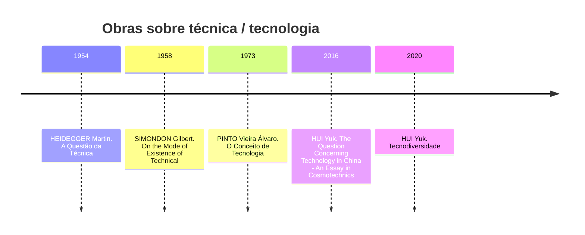

> [!note] Depois pode ser interessante transformar isso em uma [[INEF - NFF - Guia Prático de Leituras Filosóficas|ficha bibliográfica]] ou [[INEF - NFF - Guia Prático de Leituras Filosóficas|ficha temática]]

| Livro                                                                                                                                    | Anotações                                                                   |
| ---------------------------------------------------------------------------------------------------------------------------------------- | --------------------------------------------------------------------------- |
| [[HUI Yuk. Tecnodiversidade (2020)]]                                                                                                     | [[Notas - "HUI Yuk. Tecnodiversidade (2020)"]]                                                                            |
| [[HEIDEGGER Martin. A Questão da Técnica (1954)]]                                                                                        | [[Anotações sobre "HEIDEGGER Martin. A Questão da Técnica (1954)"]]         |
| [[PINTO Álvaro Vieira. O Conceito de Tecnologia - Volume 1 (1973)]]                                                                      | [[Notas - PINTO Álvaro Vieira. O Conceito de Tecnologia - Volume 1 (1973)]] |
| [[DIAS Lia Ribeiro. Inteligência Artificial, Sociedade e Classe - Como a IA impacta o trabalho, a saúde e as políticas públicas (2025)]] |                                                                             | 

## Técnica

- [[HEIDEGGER Martin. A Questão da Técnica (1954)]]
	- Lido e feito um [[Anotações sobre "HEIDEGGER Martin. A Questão da Técnica (1954)"|resumo]]
- [[HUI Yuk. Tecnodiversidade (2020)]]
	- Feito uma leitura mais rápida, pretendo retornar e fazer um fichamento / resumo

## Tecnologia

- [[BENANAV Aaron. Automação e o futuro do trabalho (2025)]]
	- Pausei para focar em [[PINTO Álvaro Vieira. O Conceito de Tecnologia - Volume 1 (1973)]]

## Técnica / Tecnologia

- [[PINTO Álvaro Vieira. O Conceito de Tecnologia - Volume 1 (1973)]]
	- O objetivo é fazer uma leitura completa da Parte Um

---

## Próximos passos

1. Finalizar a leitura da Parte 1 de [[PINTO Álvaro Vieira. O Conceito de Tecnologia - Volume 1 (1973)]]
	1. Depois fazer uma nova leitura, fichando a parte 1
2. Ir para a leitura de [[HUI Yuk. The Question Concerning Technology in China - An Essay in Cosmotechnics (2016)]]
3. Fazer uma nova leitura de [[HUI Yuk. Tecnodiversidade (2020)]] com fichamentos / resumos